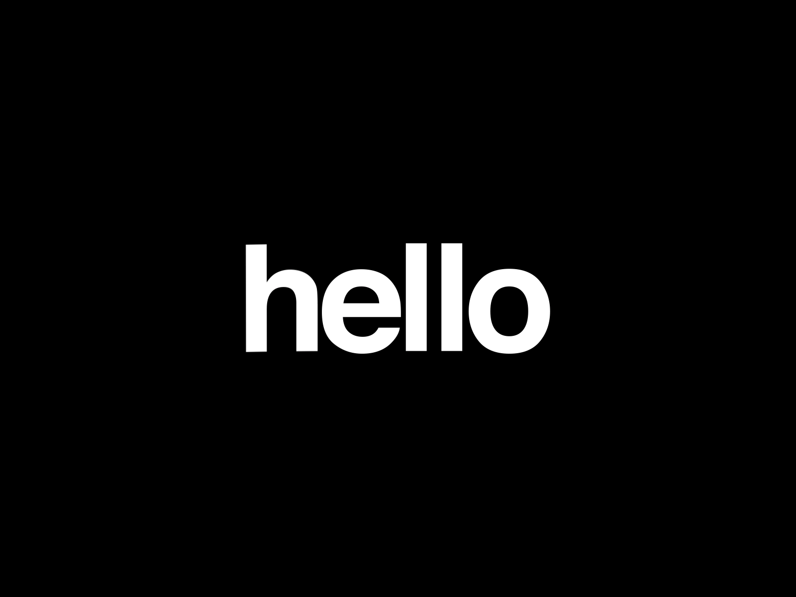
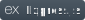
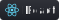
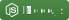
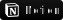
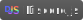

<!-- Top Section -->
<!-- INSPIRATION FROM DenverCoder1 - https://github.com/DenverCoder1/readme-typing-svg -->
<!-- Title -->

  

<!-- Auto Typing -->

  <!-- Typing SVG by DenverCoder1 - https://github.com/DenverCoder1/readme-typing-svg -->
  

<!-- Social Media -->

  
   &#8287;&#8287;&#8287;&#8287;&#8287;
  <a href="https://discordapp.com/users/989771998899109951" alt="Discord"><a>
   &#8287;&#8287;&#8287;&#8287;&#8287;

<!-- Badges -->

  

  

  

<!-- GIF -->

---

<!-- Stats -->
<h2 align="center"> ⚡ Stats </h2>
 

  

  

<!-- Experience -->

<h2 align="center">📚 Experience</h2>
 
  <h3 align="center">👨‍💻 Programming and Markup Languages</h3>
    

      
      
      
      
      
      
      
      
      
      
      
    

 
  <h3 align="center">🧰 Frameworks and Libraries</h3>
   

      
      
      
      
      
      
      
   

 
  <h3 align="center">🗄️ Databases</h3>
    

      
      
      
    

 
  <h3 align="center"> 💻 Software & Tools</h3>
    

      
      
      
      
      
      
      
      
      
      
      
      
      
      
      
    

 

<!-- Repositories -->

  <h2 align="center">📘 My Top Open Source Projects</h2>
  

 

## <!-- Footer -->

